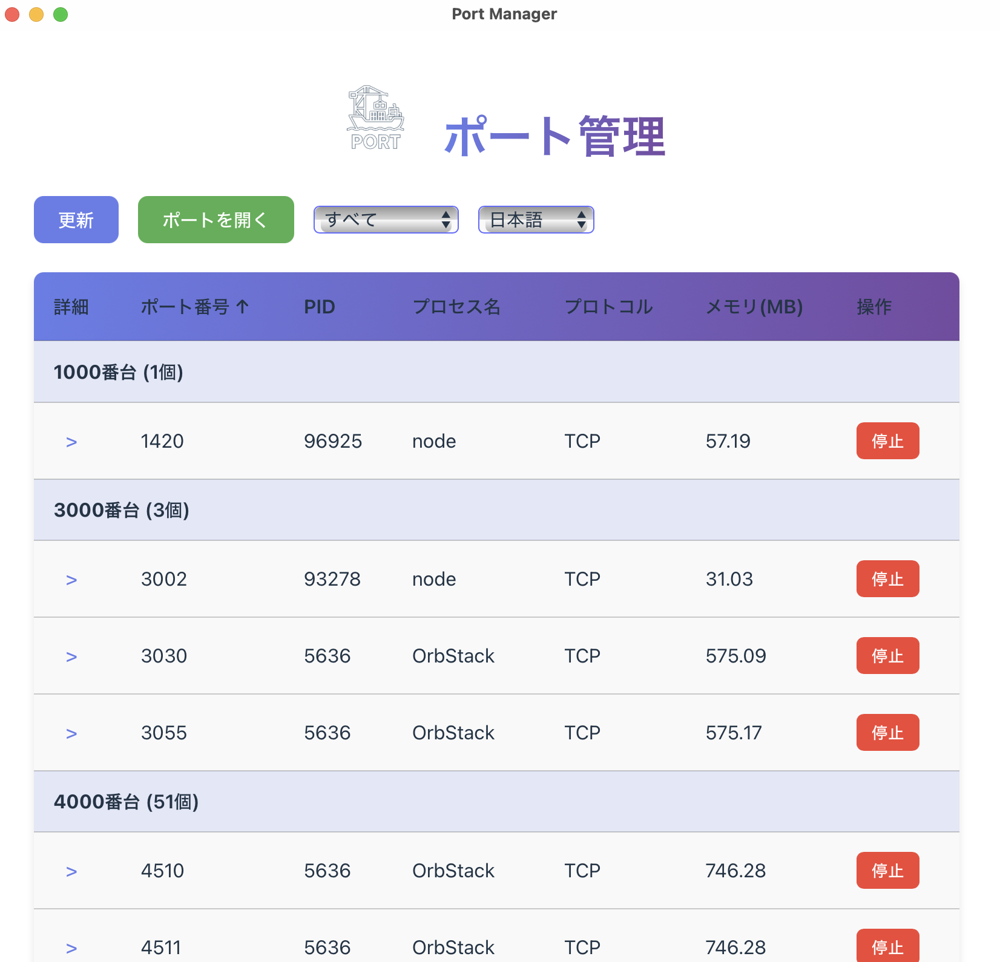

# 端口管理 🚀

[日本語](./README.ja.md) | [English](./README.md) | [中文](./README.zh.md) | [한국어](./README.ko.md) | [Español](./README.es.md) | [Français](./README.fr.md) | [Deutsch](./README.de.md)

使用Tauri 2和React构建的现代跨平台端口管理应用程序。



## ✨ 功能

- **端口监控**: 实时显示所有监听端口
- **进程详情**: 显示每个进程的详细信息
  - 命令行参数
  - 工作目录
  - 启动时间
  - 内存使用
- **端口管理**:
  - 一键停止进程
  - 在浏览器或自定义应用程序中打开端口
- **组织视图**: 按1000段对端口进行分组
- **排序**: 按端口、PID、进程名、内存使用排序
- **筛选**: 按范围筛选端口
- **多语言支持**: 支持7种语言（日语、英语、中文、韩语、西班牙语、法语、德语）

## 🚀 为什么选择Tauri？

使用**Tauri 2**构建的应用程序相比传统Electron应用具有显著优势：

- **⚡ 超快速度**: 使用系统WebView而非捆绑Chromium，实现原生性能
- **💾 最小内存占用**: 通常比Electron替代品**少用10-20倍内存**
  - Tauri应用: ~50-100 MB
  - Electron应用: ~500-1000 MB
- **📦 极小二进制大小**: 最终应用大小约3-5 MB，而Electron超过100 MB
- **🔒 增强安全性**: 基于Rust的后端，具有内存安全保证
- **🌍 跨平台**: 一次编写，在macOS、Windows和Linux上运行

这个端口管理器是Tauri能力的完美示例 - 一个功能齐全的桌面应用，拥有丰富的UI，同时保持令人难以置信的轻量和响应速度。

## 📥 安装

### 下载预构建二进制文件

1. 访问[Releases](https://github.com/Lanespire/port-manager/releases/)页面
2. 下载适合您平台的最新版本：
   - **macOS**: `.dmg` 或 `.app.tar.gz`
   - **Windows**: `.msi` 或 `.exe`
   - **Linux**: `.AppImage` 或 `.deb`
3. 安装并运行

### 开发环境设置

如果您想贡献或从源代码运行：

```bash
# 克隆仓库
git clone https://github.com/yourusername/tauri-port.git
cd tauri-port

# 安装依赖
npm install

# 开发模式运行
npm run tauri dev
```

**开发前提条件**：
- [Node.js](https://nodejs.org/) (v20.19+或v22.12+)
- [Rust](https://www.rustup.rs/)
- [Tauri CLI](https://v2.tauri.app/start/create-project/)

## 🎯 使用方法

1. **刷新**: 点击"刷新"按钮更新端口列表
2. **打开端口**: 点击"打开端口"在浏览器或自定义应用程序中打开特定端口
   - 输入端口号
   - 可选择输入自定义命令（使用`{port}`作为占位符）
3. **展开详情**: 点击`>`图标查看详细进程信息
4. **停止进程**: 点击"停止"按钮终止进程
5. **切换语言**: 使用语言下拉菜单切换语言

## 🛠️ 技术栈

- **前端**: React + TypeScript + Vite
- **后端**: Rust + Tauri 2
- **样式**: CSS3
- **i18n**: 自定义翻译系统

## 📝 平台支持

目前支持:
- **macOS** ✅

即将支持:
- **Windows** (开发中)
- **Linux** (开发中)

## 🤝 贡献

欢迎贡献！随时提交拉取请求。

1. Fork仓库
2. 创建功能分支 (`git checkout -b feature/AmazingFeature`)
3. 提交更改 (`git commit -m 'Add some AmazingFeature'`)
4. 推送到分支 (`git push origin feature/AmazingFeature`)
5. 打开拉取请求

## 📄 许可证

该项目根据MIT许可证授权 - 详见[LICENSE](LICENSE)文件。

## 🙏 致谢

- 使用[Tauri](https://tauri.app/)构建
- 图标来自[Tauri Icons](https://tauri.app/reference/icons/)

## 📧 联系方式

项目链接: [https://github.com/yourusername/tauri-port](https://github.com/yourusername/tauri-port)
